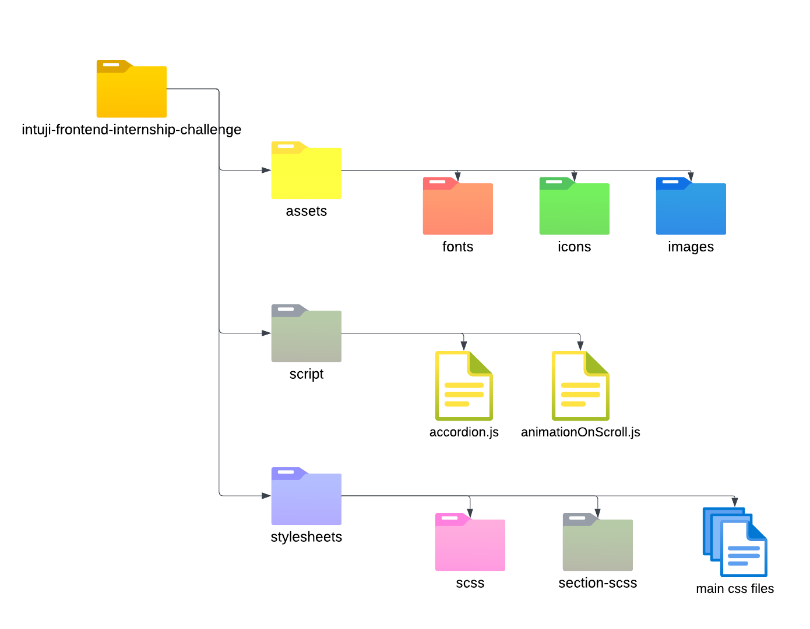

# Frontend Mock Website 

The project is responsive across various breakpoints, has JavaScript animations implemented and the CSS has been done using Sass preprocessor. 

**This website was developed in Debian using WSL2 and Vs Code**

## Accessing Website

The completed website has been hosted on Github pages, so can be viewed directly from the following link:
### GitHub Pages:  https://dbeee-acharya.github.io/intuji-frontend-internship-challenge/

The repo can also be cloned or downloaded to our local device, and from there you can access the website directly by opening the `index.html` page.

## Technologies Used

- **HTML** for the structuring and content 

- **SCSS** for styling, the SCSS page compiles to a `.css` file which is then imported to our HTML

- **JavaScript**: For animations and accordion functionality

## Major Functionalities

- **Animation on scroll**
- **Interactive buttons with `click` and `hover` animations**
- **Working accordion modal**
- **Responsive across various device widths **
- **Separation of CSS modules using SCSS and JavaScript Modules**

## Folder Structure 

